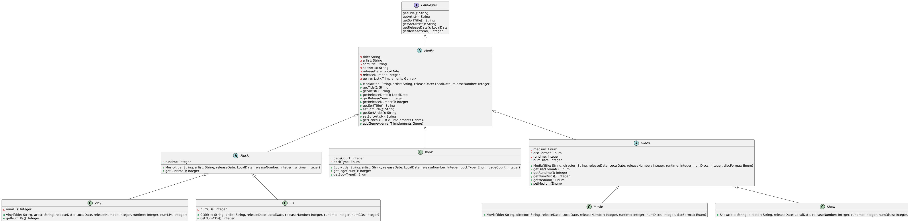

# Media Organization Tool
**not planning on pull requests for this project. this is a personal project, feel free to modify your own code though**

This is personal java project meant for organizing my physical media. this is mostly meant
for physical music and DVDs/BluRays, but i'm planning on having books implemented as well.

## Design

The implementation of media in the code uses a hierarchical design, taking advantage of the 
power of OOP programming languages. this is just practice so i don't forget everything i learned, but
it'll make future implementations of new media formats easier. for anyone who wants to tinker with the code
on their own machine, this is what the `Media` objects looks like

